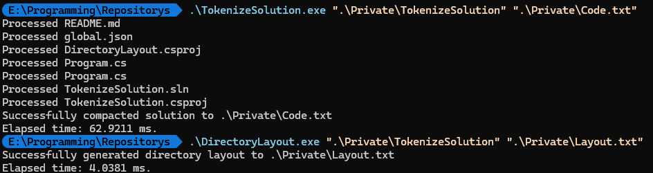

# Example Usage

## Layout Output
```
Project Structure:
📁 Example/
📁 src/
  📁 DirectoryLayout/
    🔧 [Project] DirectoryLayout.csproj
    📄 [C#] Program.cs
  📁 TokenizeSolution/
    📄 [C#] Program.cs
    🔧 [Project] TokenizeSolution.csproj
  🏗️ [Solution] TokenizeSolution.sln
  📋 [JSON] global.json
📝 [Markdown] README.md
```

## Code Output
<details> 
  <summary> To big and whitespace optimized to humanly get use out of it if you're no AI </summary>

```
### global.json
{"sdk": {"version": "9.0.0","rollForward": "latestMajor","allowPrerelease": true}}

### DirectoryLayout.csproj
<Project Sdk="Microsoft.NET.Sdk"><PropertyGroup><OutputType>Exe</OutputType><TargetFramework>net9.0</TargetFramework><ImplicitUsings>enable</ImplicitUsings><Nullable>enable</Nullable><PublishAot>true</PublishAot><InvariantGlobalization>true</InvariantGlobalization><IlcOptimizationPreference>Speed</IlcOptimizationPreference><RootNamespace>TokenizeSolution</RootNamespace><LangVersion>latest</LangVersion></PropertyGroup></Project>

### Program.cs
using System.Text;
using System.Text.RegularExpressions;
namespace TokenizeSolution;
public static class Program
{
private static readonly HashSet<string> IgnoredDirectories = new(StringComparer.OrdinalIgnoreCase)
{
"bin", "obj", ".vs", ".idea", ".vscode", ".vsconfig", ".vspscc", ".suo", ".user",
"packages", "node_modules", "bower_components", "jspm_packages", "typings",
".git", ".svn", ".hg",
".env", ".env.local", ".env.development", ".env.production", ".env.test",
"temp", "tmp", "cache", ".cache",
"logs", "*.log",
".DS_Store", "Thumbs.db", "desktop.ini",
"*.userprefs", "*.sln.cache", "*.suo", "*.lock"
};
private static readonly HashSet<string> IgnoredFiles = new(StringComparer.OrdinalIgnoreCase)
{
".gitignore", ".gitattributes", ".gitmodules", ".gitkeep",
".npmrc", ".yarnrc", ".editorconfig", ".eslintrc", ".prettierrc",
"package-lock.json", "yarn.lock", "pnpm-lock.yaml",
"*.tmp", "*.bak", "*.swp", "*.swo", "*.log", "*.pid", "*.seed", "*.pid.lock"
};
private static readonly HashSet<string> BinaryExtensions = new(StringComparer.OrdinalIgnoreCase)
{
".png", ".jpg", ".jpeg", ".gif", ".bmp", ".ico", ".svg", ".webp",
".mp3", ".wav", ".ogg", ".flac", ".aac",
".mp4", ".avi", ".mkv", ".mov", ".wmv", ".flv",
".zip", ".rar", ".tar", ".gz", ".7z",
".exe", ".dll", ".pdb", ".so", ".dylib", ".lib",
".doc", ".docx", ".xls", ".xlsx", ".ppt", ".pptx", ".pdf",
".ttf", ".otf", ".woff", ".woff2", ".eot",
".res", ".resx"
};
public static async Task Main(string[] args)
{
if ( args.Length == 0 || args.Contains("--help") )
{
ShowHelp();
return;
}
if ( args.Length < 2 )
{
Console.WriteLine("Error: Invalid number of arguments.");
ShowHelp();
return;
}
var solutionPath = args[0];
var outputFile = args[1];
var additionalIgnoredDirectories = new HashSet<string>(StringComparer.OrdinalIgnoreCase);
var additionalIgnoredFiles = new HashSet<string>(StringComparer.OrdinalIgnoreCase);
for ( var i = 2; i < args.Length; i++ )
switch ( args[i] )
{
case "--ignore-dir" when i + 1 < args.Length:
additionalIgnoredDirectories.Add(args[i + 1]);
i++;
break;
case "--ignore-file" when i + 1 < args.Length:
additionalIgnoredFiles.Add(args[i + 1]);
i++;
break;
}
try
{
var startTime = DateTime.UtcNow;
await GenerateLayoutAsync(solutionPath, outputFile, additionalIgnoredDirectories, additionalIgnoredFiles);
var endTime = DateTime.UtcNow;
Console.WriteLine($"Elapsed time: {(endTime - startTime).TotalMilliseconds} ms.");
}
catch ( Exception ex )
{
Console.WriteLine($"Error: {ex.Message}");
}
}
private static async Task GenerateLayoutAsync(string solutionPath, string outputFile,
HashSet<string> additionalIgnoredDirectories, HashSet<string> additionalIgnoredFiles)
{
var sb = new StringBuilder();
var gitignoreRules = LoadGitignoreRules(solutionPath);
var gitignoreRegexes = CompileGitignoreRules(gitignoreRules);
var allIgnoredDirectories = new HashSet<string>(IgnoredDirectories, StringComparer.OrdinalIgnoreCase);
allIgnoredDirectories.UnionWith(additionalIgnoredDirectories);
var allIgnoredFiles = new HashSet<string>(IgnoredFiles, StringComparer.OrdinalIgnoreCase);
allIgnoredFiles.UnionWith(additionalIgnoredFiles);
sb.AppendLine("Project Structure:");
await GenerateDirectoryLayoutAsync(solutionPath, solutionPath, "", sb, allIgnoredDirectories, allIgnoredFiles,
gitignoreRegexes
);
await File.WriteAllTextAsync(outputFile, sb.ToString());
Console.WriteLine($"Successfully generated directory layout to {outputFile}");
}
private static async Task GenerateDirectoryLayoutAsync(string basePath,
string currentPath,
string indent,
StringBuilder sb,
HashSet<string> ignoredDirectories,
HashSet<string> ignoredFiles,
List<Regex> gitignoreRegexes)
{
var directories = Directory.GetDirectories(currentPath);
var files = Directory.GetFiles(currentPath);
foreach ( var dir in directories.OrderBy(d => d) )
{
var dirName = Path.GetFileName(dir);
var relativePath = Path.GetRelativePath(basePath, dir).Replace('\\', '/');
if ( ignoredDirectories.Contains(dirName) ||
IsIgnoredByGitignore(relativePath, gitignoreRegexes) )
continue;
sb.AppendLine($"{indent}📁 {dirName}/");
await GenerateDirectoryLayoutAsync(
basePath, dir, indent + "  ", sb,
ignoredDirectories, ignoredFiles, gitignoreRegexes
);
}
foreach ( var file in files.OrderBy(f => f) )
{
var fileName = Path.GetFileName(file);
var fileExtension = Path.GetExtension(file);
var relativePath = Path.GetRelativePath(basePath, file).Replace('\\', '/');
if ( ignoredFiles.Contains(fileName) ||
ignoredFiles.Any(ignored => ignored.StartsWith("*.") && fileName.EndsWith(ignored[1..])) ||
BinaryExtensions.Contains(fileExtension) ||
IsIgnoredByGitignore(relativePath, gitignoreRegexes) )
continue;
var fileIcon = GetFileIcon(fileExtension);
sb.AppendLine($"{indent}{fileIcon} {fileName}");
}
}
private static List<string> LoadGitignoreRules(string directory)
{
var gitignorePath = Path.Combine(directory, ".gitignore");
if ( !File.Exists(gitignorePath) )
return [];
return File.ReadAllLines(gitignorePath)
.Where(line => !string.IsNullOrWhiteSpace(line) && !line.StartsWith('#'))
.ToList();
}
private static List<Regex> CompileGitignoreRules(List<string> gitignoreRules)
{
return gitignoreRules
.Select(rule =>
{
var pattern = rule.StartsWith('!') ? rule[1..] : rule;
var regexPattern = ConvertGitignorePatternToRegex(pattern);
return new Regex(regexPattern, RegexOptions.Compiled);
}
)
.ToList();
}
private static bool IsIgnoredByGitignore(string relativePath, List<Regex> gitignoreRegexes)
{
return gitignoreRegexes.Any(regex => regex.IsMatch(relativePath));
}
private static string ConvertGitignorePatternToRegex(string pattern)
{
var stringBuilder = new StringBuilder();
var isEscaping = false;
foreach ( var c in pattern )
if ( c is '*' or '/' )
{
if ( isEscaping )
{
stringBuilder.Length--;
isEscaping = false;
}
stringBuilder.Append(c);
}
else if ( Regex.Escape(c.ToString()).Length > 1 )
{
stringBuilder.Append('\\').Append(c);
isEscaping = true;
}
else
{
stringBuilder.Append(c);
isEscaping = false;
}
stringBuilder.Replace("**", ".*", 0, stringBuilder.Length);
stringBuilder.Replace("*", "[^/]*", 0, stringBuilder.Length);
if ( pattern.EndsWith('/') )
stringBuilder.Append(".*");
if ( pattern.StartsWith('/') )
{
stringBuilder.Insert(0, '^');
}
else
{
stringBuilder.Insert(0, "^(.*/)?(");
stringBuilder.Append(')');
}
return stringBuilder.ToString();
}
private static string GetFileIcon(string extension)
{
return extension.ToLowerInvariant() switch
{
".cs" => "📄 [C#]",
".h" => "📄 [C-Header]",
".cpp" => "📄 [C-Source]",
".csproj" => "🔧 [Project]",
".sln" => "🏗️ [Solution]",
".json" => "📋 [JSON]",
".xml" => "📋 [XML]",
".config" => "⚙️ [Config]",
".md" => "📝 [Markdown]",
".txt" => "📄 [Text]",
".yml" or ".yaml" => "⚙️ [YAML]",
".js" or ".jsx" => "📄 [JS]",
".ts" or ".tsx" => "📄 [TS]",
".css" => "🎨 [CSS]",
".scss" => "🎨 [SCSS]",
".html" => "🌐 [HTML]",
_ => "📄"
};
}
private static void ShowHelp()
{
Console.WriteLine("Usage: DirectoryLayout <solution-path> <output-file> [options]");
Console.WriteLine();
Console.WriteLine("Options:");
Console.WriteLine("  --ignore-dir <directory>    Add an additional directory to ignore");
Console.WriteLine("  --ignore-file <file>        Add an additional file to ignore");
Console.WriteLine("  --help                      Show this help message");
Console.WriteLine();
Console.WriteLine("Example:");
Console.WriteLine("  DirectoryLayout ./MyProject ./layout.txt --ignore-dir custom-bin --ignore-file *.tmp");
}
}

### Program.cs
using System.Text;
using System.Text.RegularExpressions;
using System.Threading.Channels;
namespace TokenizeSolution;
public static partial class SolutionCompactor
{
private static readonly HashSet<string> IgnoredDirectories = new(StringComparer.OrdinalIgnoreCase)
{
"bin", "obj", ".vs", ".idea", ".vscode", ".vsconfig", ".vspscc", ".suo", ".user",
"packages", "node_modules", "bower_components", "jspm_packages", "typings",
".git", ".svn", ".hg",
".env", ".env.local", ".env.development", ".env.production", ".env.test",
"temp", "tmp", "cache", ".cache",
"logs", "*.log",
".DS_Store", "Thumbs.db", "desktop.ini",
"*.userprefs", "*.sln.cache", "*.suo", "*.lock"
};
private static readonly HashSet<string> IgnoredFiles = new(StringComparer.OrdinalIgnoreCase)
{
".gitignore", ".gitattributes", ".gitmodules", ".gitkeep",
".npmrc", ".yarnrc", ".editorconfig", ".eslintrc", ".prettierrc",
"package-lock.json", "yarn.lock", "pnpm-lock.yaml",
"*.tmp", "*.bak", "*.swp", "*.swo", "*.log", "*.pid", "*.seed", "*.pid.lock"
};
private static readonly HashSet<string> BinaryExtensions = new(StringComparer.OrdinalIgnoreCase)
{
".png", ".jpg", ".jpeg", ".gif", ".bmp", ".ico", ".svg", ".webp",
".mp3", ".wav", ".ogg", ".flac", ".aac",
".mp4", ".avi", ".mkv", ".mov", ".wmv", ".flv",
".zip", ".rar", ".tar", ".gz", ".7z",
".exe", ".dll", ".pdb", ".so", ".dylib", ".lib",
".doc", ".docx", ".xls", ".xlsx", ".ppt", ".pptx", ".pdf",
".ttf", ".otf", ".woff", ".woff2", ".eot",
".res", ".resx"
};
private static async Task CompactSolutionAsync(string solutionPath, string outputFile,
HashSet<string> additionalIgnoredDirectories, HashSet<string> additionalIgnoredFiles)
{
var sb = new StringBuilder();
var channel = Channel.CreateUnbounded<string>();
var gitignoreRules = LoadGitignoreRules(solutionPath);
var gitignoreRegexes = CompileGitignoreRules(gitignoreRules);
var allIgnoredDirectories = new HashSet<string>(IgnoredDirectories, StringComparer.OrdinalIgnoreCase);
allIgnoredDirectories.UnionWith(additionalIgnoredDirectories);
var allIgnoredFiles = new HashSet<string>(IgnoredFiles, StringComparer.OrdinalIgnoreCase);
allIgnoredFiles.UnionWith(additionalIgnoredFiles);
var discoveryTask = Task.Run(() =>
DiscoverFiles(solutionPath, channel, allIgnoredDirectories, allIgnoredFiles, gitignoreRegexes)
);
var processingTasks = Enumerable.Range(0, Environment.ProcessorCount)
.Select(_ => ProcessFilesAsync(channel, sb))
.ToArray();
await discoveryTask;
channel.Writer.Complete();
await Task.WhenAll(processingTasks);
await File.WriteAllTextAsync(outputFile, sb.ToString());
Console.WriteLine($"Successfully compacted solution to {outputFile}");
}
private static int DiscoverFiles(string directory, Channel<string> channel,
HashSet<string> ignoredDirectories, HashSet<string> ignoredFiles, List<Regex> gitignoreRegexes)
{
var files = Directory.GetFiles(directory, "*.*", SearchOption.AllDirectories);
var totalFiles = files.Length;
Parallel.ForEach(files, file =>
{
var relativePath = Path.GetRelativePath(directory, file).Replace('\\', '/');
var fileName = Path.GetFileName(file);
var fileExtension = Path.GetExtension(file);
var isInIgnoredDirectory = ignoredDirectories
.Any(ignored =>
file.Contains($"{Path.DirectorySeparatorChar}{ignored}{Path.DirectorySeparatorChar}")
);
var isIgnoredFile = ignoredFiles.Contains(fileName) ||
ignoredFiles.Any(ignored =>
ignored.StartsWith("*.") && fileName.EndsWith(ignored[1..])
);
var isBinaryFile = BinaryExtensions.Contains(fileExtension);
var isIgnoredByGitignore = IsIgnoredByGitignore(relativePath, gitignoreRegexes);
if ( !isInIgnoredDirectory && !isIgnoredFile && !isBinaryFile && !isIgnoredByGitignore )
channel.Writer.TryWrite(file);
}
);
return totalFiles;
}
private static async Task ProcessFilesAsync(Channel<string> channel, StringBuilder sb)
{
await foreach ( var file in channel.Reader.ReadAllAsync() )
{
var directory = Path.GetDirectoryName(file);
if ( directory == null )
continue;
var relativePath = Path.GetRelativePath(directory, file);
var content = CompactContent(file);
var outputLine = $"### {relativePath}\n{content}\n\n";
lock ( sb )
{
sb.Append(outputLine);
Console.WriteLine($"Processed {relativePath}");
}
}
}
private static List<string> LoadGitignoreRules(string directory)
{
var gitignorePath = Path.Combine(directory, ".gitignore");
if ( !File.Exists(gitignorePath) )
return [];
return File.ReadAllLines(gitignorePath)
.Where(line => !string.IsNullOrWhiteSpace(line) && !line.StartsWith('#'))
.ToList();
}
private static List<Regex> CompileGitignoreRules(List<string> gitignoreRules)
{
return gitignoreRules
.Select(rule =>
{
var pattern = rule.StartsWith('!') ? rule[1..] : rule;
var regexPattern = ConvertGitignorePatternToRegex(pattern);
return new Regex(regexPattern, RegexOptions.Compiled);
}
)
.ToList();
}
private static bool IsIgnoredByGitignore(string relativePath, List<Regex> gitignoreRegexes)
{
return gitignoreRegexes.Any(regex => regex.IsMatch(relativePath));
}
private static string ConvertGitignorePatternToRegex(string pattern)
{
var stringBuilder = new StringBuilder();
var isEscaping = false;
foreach ( var c in pattern )
if ( c is '*' or '/' )
{
if ( isEscaping )
{
stringBuilder.Length--;
isEscaping = false;
}
stringBuilder.Append(c);
}
else if ( Regex.Escape(c.ToString()).Length > 1 )
{
stringBuilder.Append('\\').Append(c);
isEscaping = true;
}
else
{
stringBuilder.Append(c);
isEscaping = false;
}
stringBuilder.Replace("**", ".*", 0, stringBuilder.Length);
stringBuilder.Replace("*", "[^/]*", 0, stringBuilder.Length);
if ( pattern.EndsWith('/') )
stringBuilder.Append(".*");
if ( pattern.StartsWith('/') )
{
stringBuilder.Insert(0, '^');
}
else
{
stringBuilder.Insert(0, "^(.*/)?(");
stringBuilder.Append(')');
}
return stringBuilder.ToString();
}
private static string CompactContent(string filePath)
{
var extension = Path.GetExtension(filePath).ToLowerInvariant();
var content = File.ReadAllText(filePath);
content = extension switch
{
".cs" => RemoveCStyleComments(content),
".ts" or ".js" or ".jsx" or ".tsx" => RemoveCStyleComments(content),
_ => content
};
var lines = content.Split(["\r\n", "\r", "\n"], StringSplitOptions.None)
.Select(line => line.Trim())
.Where(line => !string.IsNullOrWhiteSpace(line))
.ToList();
var isXmlOrJson = lines.FirstOrDefault()?.TrimStart().StartsWith('<') == true ||
lines.FirstOrDefault()?.TrimStart().StartsWith('{') == true;
return string.Join(isXmlOrJson ? "" : "\n", lines);
}
private static string RemoveCStyleComments(string content)
{
content = CommentRegex1().Replace(content, "");
content = CommentRegex2().Replace(content, "");
content = CommentRegex3().Replace(content, "");
content = CommentRegex4().Replace(content, "");
content = CommentRegex5().Replace(content, "");
content = CommentRegex6().Replace(content, "");
return content;
}
public static async Task Main(string[] args)
{
if ( args.Length == 0 || args.Contains("--help") )
{
ShowHelp();
return;
}
if ( args.Length < 2 )
{
Console.WriteLine("Error: Invalid number of arguments.");
ShowHelp();
return;
}
var solutionPath = args[0];
var outputFile = args[1];
var additionalIgnoredDirectories = new HashSet<string>(StringComparer.OrdinalIgnoreCase);
var additionalIgnoredFiles = new HashSet<string>(StringComparer.OrdinalIgnoreCase);
for ( var i = 2; i < args.Length; i++ )
switch ( args[i] )
{
case "--ignore-dir" when i + 1 < args.Length:
additionalIgnoredDirectories.Add(args[i + 1]);
i++;
break;
case "--ignore-file" when i + 1 < args.Length:
additionalIgnoredFiles.Add(args[i + 1]);
i++;
break;
}
try
{
var startTime = DateTime.UtcNow;
await CompactSolutionAsync(solutionPath, outputFile, additionalIgnoredDirectories, additionalIgnoredFiles);
var endTime = DateTime.UtcNow;
Console.WriteLine($"Elapsed time: {(endTime - startTime).TotalMilliseconds} ms.");
}
catch ( Exception ex )
{
Console.WriteLine($"Error: {ex.Message}");
}
}
private static void ShowHelp()
{
Console.WriteLine("Usage: TokenizeSolution <solution-path> <output-file> [options]");
Console.WriteLine();
Console.WriteLine("Options:");
Console.WriteLine("  --ignore-dir <directory>    Add an additional directory to ignore");
Console.WriteLine("  --ignore-file <file>        Add an additional file to ignore");
Console.WriteLine("  --help                      Show this help message");
Console.WriteLine();
Console.WriteLine("Example:");
Console.WriteLine("  TokenizeSolution ./MyProject ./output.txt --ignore-dir custom-bin --ignore-file *.tmp");
}
[GeneratedRegex(@"/\*[\s\S]*?\*/", RegexOptions.Compiled)]
private static partial Regex CommentRegex1();
[GeneratedRegex("(?<!:)
private static partial Regex CommentRegex2();
[GeneratedRegex("/
private static partial Regex CommentRegex3();
[GeneratedRegex(@"^\s*
private static partial Regex CommentRegex4();
[GeneratedRegex(@"^\s*#(region|endregion)\s*$\n?", RegexOptions.Multiline | RegexOptions.Compiled)]
private static partial Regex CommentRegex5();
[GeneratedRegex(@"^\s*$\n", RegexOptions.Multiline | RegexOptions.Compiled)]
private static partial Regex CommentRegex6();
}

### TokenizeSolution.sln
Microsoft Visual Studio Solution File, Format Version 12.00
Project("{FAE04EC0-301F-11D3-BF4B-00C04F79EFBC}") = "TokenizeSolution", "TokenizeSolution\TokenizeSolution.csproj", "{4C11332E-0B2B-4743-89A8-CEF85B8B96CB}"
EndProject
Project("{FAE04EC0-301F-11D3-BF4B-00C04F79EFBC}") = "DirectoryLayout", "DirectoryLayout\DirectoryLayout.csproj", "{D0C6AFD7-9FE1-48CB-8484-4AA1CC6FDCE2}"
EndProject
Global
GlobalSection(SolutionConfigurationPlatforms) = preSolution
Debug|Any CPU = Debug|Any CPU
Release|Any CPU = Release|Any CPU
EndGlobalSection
GlobalSection(ProjectConfigurationPlatforms) = postSolution
{4C11332E-0B2B-4743-89A8-CEF85B8B96CB}.Debug|Any CPU.ActiveCfg = Debug|Any CPU
{4C11332E-0B2B-4743-89A8-CEF85B8B96CB}.Debug|Any CPU.Build.0 = Debug|Any CPU
{4C11332E-0B2B-4743-89A8-CEF85B8B96CB}.Release|Any CPU.ActiveCfg = Release|Any CPU
{4C11332E-0B2B-4743-89A8-CEF85B8B96CB}.Release|Any CPU.Build.0 = Release|Any CPU
{D0C6AFD7-9FE1-48CB-8484-4AA1CC6FDCE2}.Debug|Any CPU.ActiveCfg = Debug|Any CPU
{D0C6AFD7-9FE1-48CB-8484-4AA1CC6FDCE2}.Debug|Any CPU.Build.0 = Debug|Any CPU
{D0C6AFD7-9FE1-48CB-8484-4AA1CC6FDCE2}.Release|Any CPU.ActiveCfg = Release|Any CPU
{D0C6AFD7-9FE1-48CB-8484-4AA1CC6FDCE2}.Release|Any CPU.Build.0 = Release|Any CPU
EndGlobalSection
EndGlobal

### TokenizeSolution.csproj
<Project Sdk="Microsoft.NET.Sdk"><PropertyGroup><OutputType>Exe</OutputType><TargetFramework>net9.0</TargetFramework><ImplicitUsings>enable</ImplicitUsings><Nullable>enable</Nullable><PublishAot>true</PublishAot><InvariantGlobalization>true</InvariantGlobalization><IlcOptimizationPreference>Speed</IlcOptimizationPreference><RootNamespace>TokenizeSolution</RootNamespace><LangVersion>latest</LangVersion></PropertyGroup><ItemGroup><RuntimeHostConfigurationOption Include="System.Globalization.Invariant" Value="true"/></ItemGroup><ItemGroup><PackageReference Include="CommunityToolkit.HighPerformance" Version="8.4.0" /></ItemGroup></Project>
```
</details>
